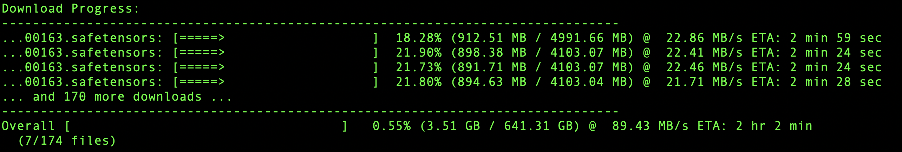

## AI Assistance
This project was developed with assistance from AI coding tools including Claude Sonnet 4 and Gemini Pro 2.5 

# DL (Rust Edition)

DL is a command-line tool written in Rust for downloading multiple files concurrently from a list of URLs or a Hugging Face repository. It features a dynamic progress bar display for each download, showing speed, percentage, and downloaded/total size. The tool supports advanced Hugging Face repository handling, including interactive selection of specific `.gguf` files or series.
Auto-update is available with `dl update-app`.



## Quick Start

1.  **Install Rust:** If you don't have Rust, install it from [rust-lang.org](https://www.rust-lang.org/tools/install).

2.  **Build the tool:**
    ```bash
    cargo build --release
    ```
    The binary will be at `./target/release/dl`. For convenience, you might want to add `./target/release` to your system's PATH or copy the `dl` executable to a directory already in your PATH.

3.  **Download from a URL list:**
    ```bash
    dl -f ../download_links.txt -c 4
    ```

4.  **Download from a Hugging Face repo:**
    ```bash
    dl -H "Qwen/Qwen3-30B-A3B"
    ```

5.  **Select a GGUF file/series from a Hugging Face repo:**
    ```bash
    dl -H "unsloth/DeepSeek-R1-0528-GGUF" -s
    ```

6.  **Download a pre-defined model by alias:**
    ```bash
    dl -m qwen3-0.6b
    ```

7.  **Search for models on Hugging Face:**
    ```bash
    dl model search llama 7b gguf
    ```

8.  **Self-update the tool:**
    ```bash
    dl update-app
    ```

### Features

*   **Concurrent Downloads:** Download multiple files at once, with configurable concurrency.
*   **Multiple Input Sources:** Download from a URL list (`-f`), Hugging Face repo (`-H`), direct URLs, or a model registry (`-m`).
*   **Model Registry:** Use `-m <alias>` to download popular models by shortcut.
*   **Model Search:** Search Hugging Face models from the command line.
*   **Resume Downloads:** Automatically resumes interrupted downloads if the server supports it.
*   **Hugging Face GGUF Selection:** Use `-s` to interactively choose `.gguf` files or series.
*   **Dynamic Progress Bars:** A clean and efficient UI powered by `indicatif`, showing consistent progress, speed, and human-readable ETA.
*   **Organized Output:** Downloads go to `downloads/`, with subfolders for Hugging Face repos and models.
*   **Error Handling:** Clear error messages and robust handling of download issues.
*   **Debug Logging:** Enable with `--debug` (logs to `log.log`).
*   **Self-Update:** Update the tool with `update`.
*   **Cross-Platform:** Built with Rust for Windows, macOS, and Linux.

### Command-Line Arguments

Run `dl --help` for a full list of commands and flags.

> **Note:** You must provide only one of the following: `-f`, `-H`, `-m`, or direct URLs.

*   `-c <concurrency>`: (Optional) Number of concurrent downloads. Defaults to `3`.
*   `-f <path_to_urls_file>`: Download from a text file of URLs.
*   `-H <repo_id>`: Download from a Hugging Face repo (`owner/repo_name` or full URL).
*   `-m <model_alias>`: Download a pre-defined model by alias.
*   `--token`: Use the `HF_TOKEN` environment variable for Hugging Face API requests.
*   `-s, --select`: (Hugging Face only) Interactively select `.gguf` files or series.
*   `--debug`: Enable debug logging to `log.log`.

**Subcommands:**
*   `model search <query>`: Search Hugging Face models.
*   `update`: Self-update the tool.

---

## Build for all platforms

To build the tool for all supported platforms, run the included shell script:

```bash
./build.sh

This will produce binaries for macOS (Intel/ARM), Windows (x64/ARM), and Linux (x64/ARM) in the build/ directory, provided you have the necessary Rust cross-compilation targets installed.

## License

This project is licensed under the MIT License.